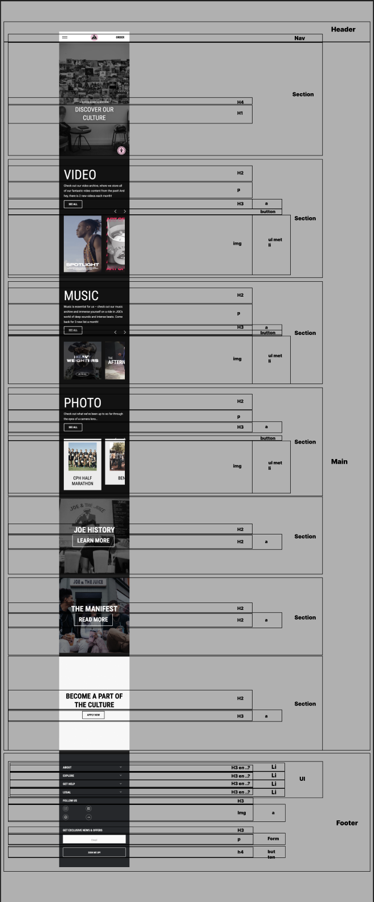

# Procesverslag
Markdown is een simpele manier om HTML te schrijven.  
Markdown cheat cheet: [Hulp bij het schrijven van Markdown](https://github.com/adam-p/markdown-here/wiki/Markdown-Cheatsheet).

Nb. De standaardstructuur en de spartaanse opmaak van de README.md zijn helemaal prima. Het gaat om de inhoud van je procesverslag. Besteedt de tijd voor pracht en praal aan je website.

Nb. Door *open* toe te voegen aan een *details* element kun je deze standaard open zetten. Fijn om dat steeds voor de relevante stuk(ken) te doen.

## Jij

  
uitwerken voor kick-off werkgroep

  ### Auteur:
  Belle van der Velde

  #### Je startniveau:
  Blauw

  #### Je focus:
  hier je focus (kies uit responsive óf surface plane)
  surface plane:
  - video
  - Scroll animaties (animation-timeline, intersection observer…) 
  - dark/light mode
  - SVG (icons) stylen en animeren 
  - Prefers-reduced-motion 

## Je website

  
uitwerken voor kick-off werkgroep

  ### Je opdracht:
  link naar de website die je gaat namaken óf de naam/omschrijving van je eigen ontwerp
  https://www.joejuice.com/
  #### Screenshot(s) van de eerste pagina (small screen): 
  Homepagina
  

  #### Screenshot(s) van de tweede pagina (small screen):
  Culturepagina 
  
 

## Toegankelijkheidstest 1/2 (week 1)

  
uitwerken na test in 2e werkgroep

  
  
  
  
  
  ### Bevindingen
  Lijst met je bevindingen die in de test naar voren kwamen:
  
  - Het duurt erg lang om de hele pagina door te lezen, omdat de voice-over alles gaat benoemen.
  - Niet alle afbeeldingen worden vertelt.

## Breakdownschets (week 1)

  
uitwerken na afloop 3e werkgroep

  ### de hele pagina: 
  

  ### de hele 2e pagina: 
  

  ### dynamisch deel (bijv menu): 
  

## Voortgang 1 (week 2)

  
uitwerken voor 1e voortgang

  ### Stand van zaken  
  Zijn alle headings goed geplaatst? En is de header goed onder verdeeld?

  ### Agenda voor meeting
  samen met je groepje opstellen

  | student 1      | student 2          | student 3    | student 4        |
  | ---            | ---                | ---          | ---              |
  | dit bespreken  | en dit             | en ik dit    | en dan ik dat    |
  | en dat ook nog | dit als er tijd is | nog een punt | dit wil ik zeker |
  | ...            | ...                | ...          | ...              |

  ### Verslag van meeting
  hier na afloop snel de uitkomsten van de meeting vastleggen

  - verander de header in de main naar een section.
  - goed gekeken naar ul en li 
  - voor de rest goed gedaan en nu verder naar css

## Voortgang 2 (week 3)

  
uitwerken voor 2e voortgang

  ### Stand van zaken
Ziet alles er goed uit? Ik moet vooral gewoon verder werken en heb verder geen vragen.

  ### Agenda voor meeting
  samen met je groepje opstellen

  | student 1      | student 2          | student 3    | student 4        |
  | ---            | ---                | ---          | ---              |
  | dit bespreken  | en dit             | en ik dit    | en dan ik dat    |
  | en dat ook nog | dit als er tijd is | nog een punt | dit wil ik zeker |
  | ...            | ...                | ...          | ...              |

  ### Verslag van meeting
  hier na afloop snel de uitkomsten van de meeting vastleggen

 Vooral verder werken aan css, want er is nog niet veel gebeurd. 

## Toegankelijkheidstest 2/2 (week 4)

  
uitwerken na test in 9e werkgroep

    
  
  
  
  

  ### Bevindingen
  Lijst met je bevindingen die in de test naar voren kwamen (geef ook aan wat er verbeterd is):

  Tijdens het testen met screenreader ging alles eigenlijk wel goed. Hij leest alles goed voor en beschrijft bijna elke afbeelding. Hij leest alleen de video niet en de achtergrond afbeeldingen niet, maar voor de rest doet alles het goed en vertelt hij ook de headings goed. Ook leest hij waar de linkjes naartoe gaan. 

Met de wcag

## Voortgang 3 (week 4)

  
uitwerken voor 3e voortgang

  ### Stand van zaken
Vooral kijken naar css, of alles goed is. 
Mijn css is heel lang, is dat een probleem? 

Vragen:
- Ik krijg de checkbox (section 8) niet gestyled que border en het transparant maken.
- Ik krijg de a in derde section niet te pakken.
- Hoe doen met tweede pagina stylen, sybren zei meerdere css bestanden aanmaken, maar is dat de bedoeling. want hoe doe je het met 1 pagina en nth of type.
- Vragen over 5 dingen van surface plane (video, animatie van teksten tijdens scrollen)
- Css bestand is nu heel lang (was eerst langer), ik heb nu de buttons en heading al samengevoegd. Is de lengte dan nu oke of kan hij nog korter?

  ### Agenda voor meeting
  samen met je groepje opstellen

  | student 1      | student 2          | student 3    | student 4        |
  | ---            | ---                | ---          | ---              |
  | dit bespreken  | en dit             | en ik dit    | en dan ik dat    |
  | en dat ook nog | dit als er tijd is | nog een punt | dit wil ik zeker |
  | ...            | ...                | ...          | ...              |

  ### Verslag van meeting
  hier na afloop snel de uitkomsten van de meeting vastleggen

Alles ziet er netjes uit. Het maakt niet uit dat de css lang is, als je het maar zo kort mogelijk maakt, door dingen samen te voegen. 
Voor de rest hard verder werken aan de tweede pagina.

## Eindgesprek (week 5)

  
uitwerken voor eindgesprek

  ### Je uitkomst - karakteristiek screenshots:
  

  ### Dit ging goed/Heb ik geleerd: 
  Korte omschrijving met plaatjes
    

  Dark light mode geleerd, wat eigenlijk heel makkelijk is. 
  De carousel ging goed, maar vind ik heel lastig, dus niet overal gelukt. Heb ik ook gemaakt met hulp van medestudenten, dus daar kan ik wel nog meer over leren. 
  Animaties gingen goed. 
  Ik heb geleerd hoe je met svg's werkt. Voorheen had ik eigenlijk alleen maar afbeeldingen, maar nu ook veel svg's.

  

  ### Dit was lastig/Is niet gelukt:
  Korte omschrijving met plaatjes

  stylen van checkbox op eerste pagina. 
  voor nu het werkend maken van de carousel op de tweede pagina niet gelukt.

  

## Bronnenlijst

  
continu bijhouden terwijl je werkt

  Nb. Wees specifiek ('css-tricks' als bron is bijv. niet specifiek genoeg). 
  Nb. ChatGpT en andere AI horen er ook bij.
  Nb. Vermeld de bronnen ook in je code.

  1. Coding2GO. (2024, 28 juli). Create a Dark Mode Switch with HTML, CSS, JavaScript [Video]. YouTube. https://www.youtube.com/watch?v=_gKEUYarehE
  2. Coyier, C. (2022, 8 februari). No Motion Isn't Always Prefers-reduced-motion | CSS-Tricks. CSS-Tricks. https://css-tricks.com/nuking-motion-with-prefers-reduced-motion/
  3. Gavor, D. (2025, 13 januari). Cool CSS Hamburger Menus and Their Animations. Slider Revolution. https://www.sliderrevolution.com/resources/css-hamburger-menu/
  4. : The Video Embed element - HTML: HyperText Markup Language | MDN. (2024, 19 december). MDN Web Docs. https://developer.mozilla.org/en-US/docs/Web/HTML/Element/video
  5. background-image - CSS: Cascading Style Sheets | MDN. (2024, 19 december). MDN Web Docs. https://developer.mozilla.org/en-US/docs/Web/CSS/background-image

